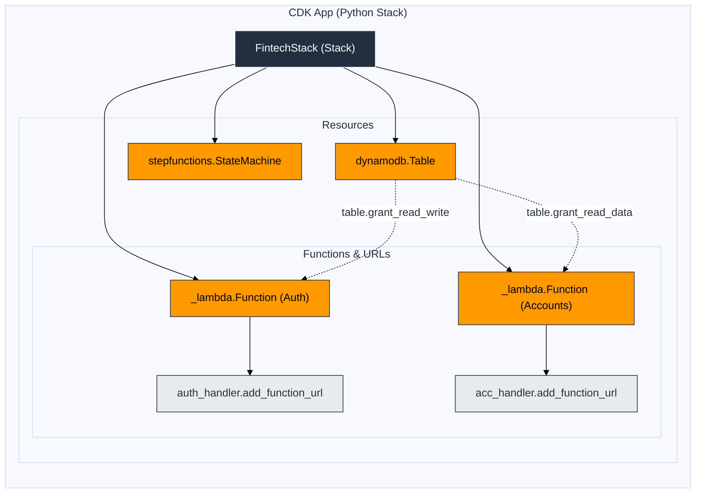

```mermaid 
%%{init: { 'theme': 'base', 'themeVariables': { 'primaryTextColor': '#232f3e', 'edgeLabelBackground':'#ffffff', 'tertiaryTextColor': '#232f3e' } } }%%
graph LR
    subgraph "CDK App (Python Stack)"
        Stack["FintechStack (Stack)"]
        
        subgraph "Resources"
            DDB["dynamodb.Table"]
            SFN["stepfunctions.StateMachine"]
            
            subgraph "Functions & URLs"
                AuthL["_lambda.Function (Auth)"]
                AuthURL["auth_handler.add_function_url"]
                
                AccL["_lambda.Function (Accounts)"]
                AccURL["acc_handler.add_function_url"]
            end
        end
    end

    %% Deployment Relationships
    Stack --> DDB
    Stack --> SFN
    Stack --> AuthL
    Stack --> AccL

    %% Logic Connections
    AuthL --> AuthURL
    AccL --> AccURL

    %% IAM Permissions
    DDB -.->|"table.grant_read_write"| AuthL
    DDB -.->|"table.grant_read_data"| AccL
    
    classDef cdk fill:#232f3e,stroke:#ffffff,color:#ffffff
    classDef aws fill:#ff9900,stroke:#232f3e,color:#000000
    classDef url fill:#e7ebed,stroke:#232f3e,color:#232f3e
    
    class Stack cdk
    class DDB,SFN,AuthL,AccL aws
    class AuthURL,AccURL url
```