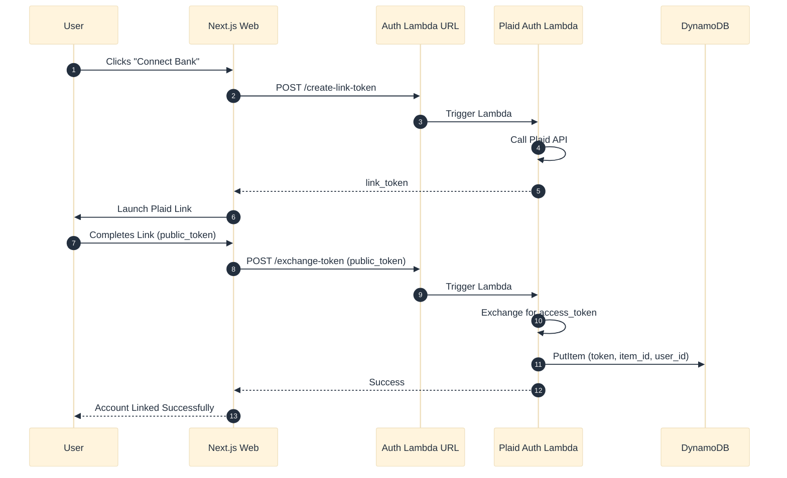
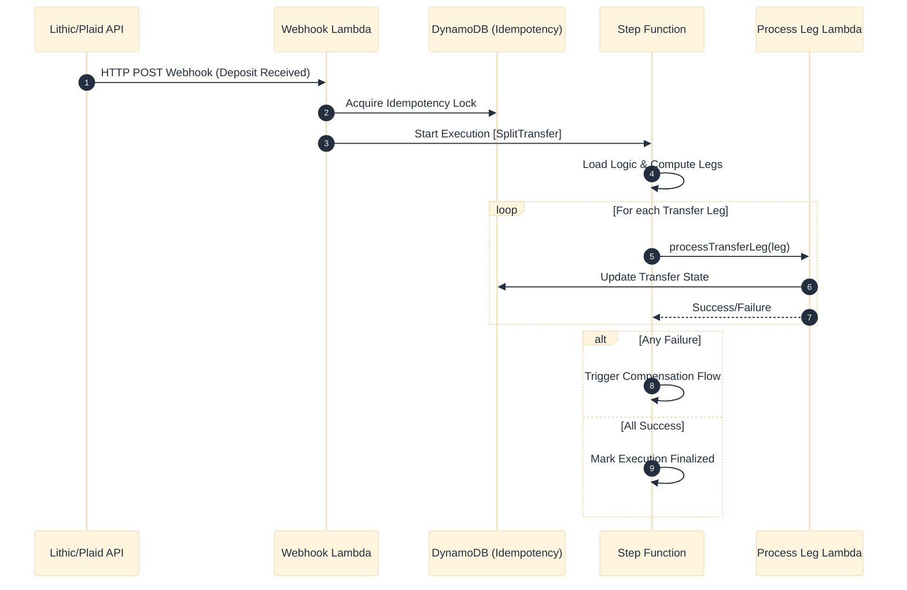

# System Sequence Diagrams

## 1. Bank Connection Flow (Lambda URL)

```mermaid
%%{init: { 
  'theme': 'base', 
  'config': { 'background': 'white' },
  'themeVariables': { 
    'primaryTextColor': '#232f3e', 
    'edgeLabelBackground':'#ffffff', 
    'tertiaryTextColor': '#232f3e' 
  } 
} }%%
sequenceDiagram
    autonumber
    participant User
    participant Web as Next.js Web
    participant URL as Auth Lambda URL
    participant L_Auth as Plaid Auth Lambda
    participant DDB as DynamoDB
    User->>Web: Clicks "Connect Bank"
    Web->>URL: POST /create-link-token
    URL->>L_Auth: Trigger Lambda
    L_Auth->>L_Auth: Call Plaid API
    L_Auth-->>Web: link_token
    Web->>User: Launch Plaid Link
    User->>Web: Completes Link (public_token)
    Web->>URL: POST /exchange-token (public_token)
    URL->>L_Auth: Trigger Lambda
    L_Auth->>L_Auth: Exchange for access_token
    L_Auth->>DDB: PutItem (token, item_id, user_id)
    L_Auth-->>Web: Success
    Web-->>User: Account Linked Successfully
```

```mermaid
%%{init: { 
  'theme': 'base', 
  'config': { 'background': 'white' },
  'themeVariables': { 
    'primaryTextColor': '#232f3e', 
    'edgeLabelBackground':'#ffffff', 
    'tertiaryTextColor': '#232f3e' 
  } 
} }%%
sequenceDiagram
    autonumber
    participant Ext as Lithic/Plaid API
    participant L_Wh as Webhook Lambda
    participant DDB as DynamoDB (Idempotency)
    participant SFN as Step Function
    participant L_Leg as Process Leg Lambda
    Ext->>L_Wh: HTTP POST Webhook (Deposit Received)
    L_Wh->>DDB: Acquire Idempotency Lock
    L_Wh->>SFN: Start Execution [SplitTransfer]
    SFN->>SFN: Load Logic & Compute Legs
    loop For each Transfer Leg
        SFN->>L_Leg: processTransferLeg(leg)
        L_Leg->>DDB: Update Transfer State
        L_Leg-->>SFN: Success/Failure
    end
    alt Any Failure
        SFN->>SFN: Trigger Compensation Flow
    else All Success
        SFN->>SFN: Mark Execution Finalized
    end
```