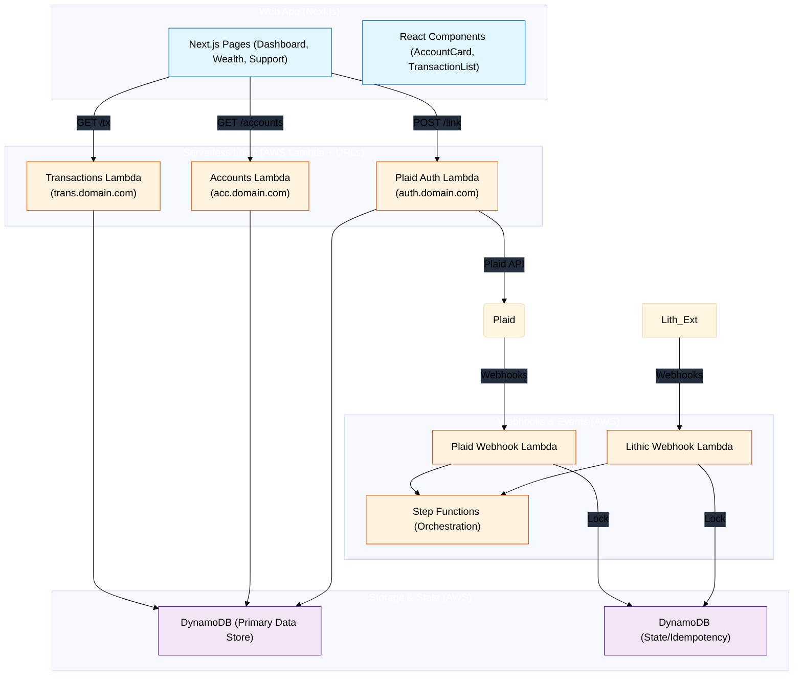

```mermaid
%%{init: { 'theme': 'base', 'themeVariables': { 'primaryTextColor': '#000000', 'edgeLabelBackground':'#232f3e', 'tertiaryTextColor': '#FFFFFF' } } }%%
graph TD
    subgraph "Web App (Next.js)"
        Web["Next.js Pages (Dashboard, Wealth, Support)"]
        UI["React Components (AccountCard, TransactionList)"]
    end

    subgraph "Serverless Logic (AWS Lambda + URLs)"
        L_Auth["Plaid Auth Lambda<br/>(auth.domain.com)"]
        L_Acc["Accounts Lambda<br/>(acc.domain.com)"]
        L_Trans["Transactions Lambda<br/>(trans.domain.com)"]
    end

    subgraph "Storage & State (AWS)"
        DDB["DynamoDB (Primary Data Store)"]
        DDB_State["DynamoDB (State/Idempotency)"]
    end

    subgraph "Webhooks & Events (AWS)"
        L_Lith["Lithic Webhook Lambda"]
        L_Plaid["Plaid Webhook Lambda"]
        SFN["Step Functions (Orchestration)"]
    end

    %% Web to Lambda URLs
    Web -->|"POST /link"| L_Auth
    Web -->|"GET /accounts"| L_Acc
    Web -->|"GET /tx"| L_Trans
    
    %% Internal Connections
    L_Auth --> DDB
    L_Acc --> DDB
    L_Trans --> DDB
    
    L_Lith --> SFN
    L_Plaid --> SFN
    L_Lith -- "Lock" ---> DDB_State
    L_Plaid -- "Lock" ---> DDB_State

    %% External
    L_Auth -- "Plaid API" ---> Plaid_Ext(Plaid)
    Plaid_Ext -- "Webhooks" ---> L_Plaid
    Lith_Ext -- "Webhooks" ---> L_Lith

    classDef web fill:#e1f5fe,stroke:#01579b
    classDef aws fill:#fff3e0,stroke:#e65100
    classDef db fill:#f3e5f5,stroke:#4a148c
    
    class Web,UI web
    class L_Auth,L_Acc,L_Trans,L_Lith,L_Plaid,SFN aws
    class DDB,DDB_State db
```